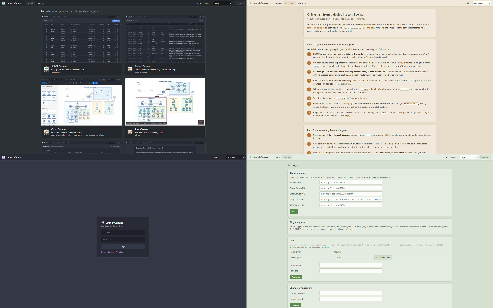

# LaunchCanvas - The Suite's Front Door

> One login, every Canvas app. A small, self-hostable portal that signs you
> into the whole suite, launches each sibling from one tile page, and puts
> board files where the wall can read them - no ports memorized, no SCP.



LaunchCanvas is the sixth member of the Canvas family:
[**CrossCanvas**](https://github.com/RootSwitch/CrossCanvas) draws your
network, [**PingCanvas**](https://github.com/RootSwitch/PingCanvas) turns
those diagrams into a live reachability wall,
[**SNMPCanvas**](https://github.com/RootSwitch/SNMPCanvas) graphs the
performance history,
[**SyslogCanvas**](https://github.com/RootSwitch/SyslogCanvas) remembers
what your devices said, and
[**AlertCanvas**](https://github.com/RootSwitch/AlertCanvas) turns readings
into notifications. LaunchCanvas is the door you walk in through: log in
once, launch any of them.

**Install the whole suite in one command:** the [canvas-suite](https://github.com/RootSwitch/canvas-suite) repo is the family's landing page, with one-shot install scripts for the full six-app stack or a Pi-class PingCanvas + AlertCanvas pair.

## How it works

```
you ──login──► LaunchCanvas ──sets one host-wide signed token──┐
                    │                                          ▼
                    └──tiles──► SNMPCanvas / SyslogCanvas / AlertCanvas
                                              (already logged in via the token)
                            └──► CrossCanvas / PingCanvas (no login of their own)
```

One Node process: a login page, a tile launcher, and a couple of small
conveniences. On login it mints an HMAC-signed token (shared `SUITE_SECRET`)
into a host-wide cookie - browsers scope cookies by host, not port, so every
sibling on the box receives it, verifies the signature with the same secret,
and silently upgrades you to a normal local session. No proxy, no rewritten
URLs, no per-app password vault: the apps simply trust the portal's
signature. Remove `SUITE_SECRET` and the portal degrades gracefully into a
plain launcher with per-app logins.

## Features

- **One login for the suite** - opt-in single sign-on across SNMPCanvas,
  SyslogCanvas, and AlertCanvas via a signed, expiring token (24h,
  re-minted on every portal visit). Logging out at the portal is the
  suite-wide logout. Rotate `SUITE_SECRET` to revoke every token at once.
- **The launcher** - a tile per app, in the family style, each linking to
  the right host and port so nobody keeps a bookmark folder of five ports.
  Tile URLs derive automatically from the portal's own address and each
  app's stock port; override any of them in Settings when an app lives
  somewhere unusual.
- **Board upload, download, and round-trip editing** - send an `.xcanvas`
  exported from CrossCanvas straight to the directory the PingCanvas kiosk
  reads, from the browser; validated, size-capped, written atomically, and
  the previous board is kept as a one-click backup. **Download** grabs the
  live board back out (e.g. one the setup script's `--scan` seeded), and
  **Edit in CrossCanvas** opens it directly in the editor - arrange, File >
  Save, upload, done. The SCP step is gone in both directions. The raw
  endpoints (`GET`/`POST /api/board`) accept any content type, so `curl
  --data-binary` automation works too.
- **Per-user accounts, suite-wide** - every human gets a username and
  password at the portal (scrypt-hashed), and the SSO token carries the
  username into every app - so multi-user reached the whole suite as a
  portal-side feature, not a five-app rework. No roles: every account is
  equal and can manage accounts; the last account and your own cannot be
  deleted. Sessions, login rate limiting, and automatic HTTPS are the
  family standard. Lost every password? Delete data/launchcanvas.db - the
  portal keeps no history, only tile URL overrides.
- **In-app suite docs** - a suite overview, a ten-minute quickstart (device
  list to live wall, both the diagram-first and inventory-first paths), and a
  one-pager per app, served by the portal with no login required. The address
  you give someone is now also the place they learn the suite - no tour of
  six GitHub READMEs needed to get started.
- **30 themes** - Classic plus 29 shared with CrossCanvas's palette family,
  grouped the same way (Paper / Warm / Cool / Night / Screen).

## Small on purpose

LaunchCanvas is a door, not a dashboard. It does not proxy traffic, embed
the apps in frames, aggregate their data, or watch anything - the siblings
are already good at being themselves, and the kiosk stays a wall display
that needs no login at all. Keeping the moving parts few is a design
choice - and if you want it to become something bigger, the license makes
forking genuinely easy.

## Quick start (Docker)

> **Installed via the [canvas-suite](https://github.com/RootSwitch/canvas-suite)
> script?** Skip this section - the override (SUITE_SECRET, board dir
> mount) is already written and the portal is running on 9160. The script
> seeds the `admin` account and prints its password once - there is no
> first-run page to claim, by design. Lost it? It is in
> `/opt/canvas-suite/launchcanvas/docker-compose.override.yml` (mode 600, so
> `sudo grep ADMIN_PASSWORD` it). Change it from Settings once you are in.
> **On Windows?** Skip the `chown` steps (Docker Desktop handles ownership);
> set env vars PowerShell-style (`$env:NAME = 'value'; npm start`); and
> `tools/gen-cert.sh` needs Git Bash or WSL - or drop your own PEM pair at
> the cert paths.

```yaml
# docker-compose.yml (in the repo; abridged)
services:
  launchcanvas:
    build: .
    ports: ["9160:9160"]
    volumes:
      - ./data:/data:z
      - ../pingcanvas/data:/boards:z   # where board uploads land
    environment:
      - TZ=Etc/UTC
      #- SUITE_SECRET=a-long-random-string   # enables SSO - see below
```

```
mkdir -p data && sudo chown 1000:1000 data   # container runs as uid 1000
docker compose up -d --build
```

Open `http://host:9160`, create the first account on the first-run page,
and you have a launcher. (The default port sits one door down from SNMPCanvas's
9161 - the 916x row reads portal, poller, alerter.)

One first-run note: the setup page belongs to whoever reaches the port
first, so on anything but a trusted segment either set `ADMIN_PASSWORD` in
the compose file or claim the page immediately after `up -d`.

### Enabling single sign-on

Generate one secret and give it to the portal **and** each Node sibling
(compose `environment:` or an override file):

```
openssl rand -base64 32
```

```yaml
# on launchcanvas, snmpcanvas, syslogcanvas, alertcanvas alike:
    environment:
      - SUITE_SECRET=<that value>
```

Restart the four containers. Log into the portal; the tiles now open the
siblings already authenticated. Notes:

- Apps without the secret keep their own login - SSO is per-app opt-in.
- PingCanvas's kiosk and editor have no login at all; nothing changes there.
- Mixed HTTP/HTTPS weakens this: a `Secure` cookie set by an HTTPS portal
  is not sent to plain-HTTP siblings. Run the suite all-HTTP or all-HTTPS
  (the suite setup script does the latter by default).
- Logging out of a sibling while the portal token is valid signs you
  straight back in on the next request - by design, that is what SSO means.
  Log out at the portal to log out everywhere.

### Board uploads

Mount the directory your PingCanvas kiosk reads boards from at `/boards`
(the stock compose assumes the sibling-checkout layout; the suite's shared
data root works the same with an override). Uploads replace
`board.xcanvas` atomically and keep the previous file as
`board.xcanvas.bak`, restorable from the UI. No mount, no upload UI - the
feature disables itself.

### Your own theme

Twenty-nine themes ship in the picker. If none of them is your organisation's
colours, add a thirtieth without touching the app: drop a `theme.json` in the
data directory and it appears at the top of the list.

Start from whichever shipped theme is closest, rather than from a blank file:

```
node tools/export-theme.js nocturne > data/theme.json
node tools/check-theme.js
```

Then edit the hex values. It is a flat object of the same fifteen `--se-*`
variables the built-in themes use, and **you only need the ones you want to
change** - anything you leave out inherits Classic, so a three-line file is
valid:

```json
{
  "label": "Acme",
  "vars": { "--se-panel": "#101820", "--se-accent": "#e8734a" }
}
```

Because `data/` is a bind mount, **no rebuild is involved**. Edit the file,
refresh the browser, and it is there. Delete the file and the entry disappears.
Values must be hex; anything else is refused and logged rather than applied.

Running the whole suite? Point every app's data mount at one shared directory
(`canvas-suite-setup.sh` already does) and a single `theme.json` themes all of
them at once.

**`tools/check-theme.js` also audits readability**, because fifteen variables
include `--se-up`, `--se-down` and `--se-warn`, and these apps get left open on
a wall: a palette where healthy and failed do not separate at a glance is a
different kind of problem from one that is merely ugly. It checks text contrast
against WCAG AA and flags state colours too close in hue or too washed out to
read as a state at all.

It reports; it never refuses. Some of the shipped themes would warn too - they
were designed for the CrossCanvas editor first, with monitoring layered on
later, and a few exist mostly because they are fun. Amber in particular puts
`up` and `down` only 36 degrees apart, which is the point of a monochrome CRT
look and is worth knowing before you put it on a wall.

### HTTPS

Run the included script once on the docker host, then restart:

```
./tools/gen-cert.sh 192.168.1.50 nas.lan    # your host's IPs / names
docker compose restart
```

It writes a self-signed cert to `data/certs/server.crt` + `server.key`; the
server detects the pair at startup and switches to HTTPS on the same port
(session cookies become `Secure` automatically).

### Environment variables

| Var | Default | Purpose |
|---|---|---|
| `PORT` | `9160` | HTTP/HTTPS listen port |
| `TZ` | `Etc/UTC` | Timezone for log timestamps |
| `ADMIN_PASSWORD` | - | Seeds the first account (user `admin`) on first boot only |
| `SUITE_SECRET` | - | Shared HMAC key that enables SSO across the Node siblings (see above) |
| `BOARD_DIR` | `/boards` | Where board uploads land; the upload UI hides itself if it isn't a directory |
| `TLS_CERT` / `TLS_KEY` | `<data>/certs/server.*` | Cert/key paths; HTTPS turns on when both exist |
| `COOKIE_SECURE` | auto | `1` forces the `Secure` cookie flag (set it when TLS is terminated by a reverse proxy, not by this app); `0` forces it off |
| `TRUST_PROXY` | - | `1` = honor `X-Forwarded-For` for the login rate limiter (only behind a reverse proxy you control; the last hop is used) |
| `LAUNCHCANVAS_DATA` | `./data` | Data directory (SQLite + certs) |

## Security posture

Same trusted-LAN posture as the family: per-user accounts with scrypt
hashes, no public exposure, TLS optional but one script away. A few facts
about the accounts and the SSO token are worth knowing before you rely on
them:

- **Every account is a full suite administrator.** There are no roles: any
  signed-in user can add users, remove others, and reset another user's
  password without knowing it. A portal account is effectively suite root -
  one phished account is the whole suite. Hand out accounts accordingly.
- **`SUITE_SECRET` is possession of the suite.** Anyone who has it can mint
  a valid token for any username. Treat it like the other suite secrets (it
  lives only in compose override files).
- **The token is stateless, so revocation is coarse.** A minted token is
  valid until it expires (24h, re-minted on every portal visit) or until
  `SUITE_SECRET` is rotated. Consequences: a portal password change does not
  invalidate already-minted tokens, and **deleting a user does not reach into
  their browser** - their existing token keeps working on the sibling apps
  for up to 24h. To cut an off-boarded user off immediately, rotate
  `SUITE_SECRET` (which signs everyone out - they log in once more).
- **The SSO cookie is host-wide, not port-scoped.** Browsers send it to
  every service on the portal's hostname - including login-free PingCanvas
  and any non-suite app you happen to run there (an Uptime Kuma on the same
  host, say). Any such app can read a valid 24h suite credential from its
  request headers. Run only trusted services on the portal's hostname, or
  give the portal its own name.
- **Fresh sub-apps can't be claimed out from under the suite.** On a new
  install the SSO token logs you straight into SNMPCanvas / SyslogCanvas /
  AlertCanvas, so you never meet their first-run password page - and it
  would be a hazard if a passer-by did (a mistyped port, an inherited
  bookmark). With `SUITE_SECRET` set, those apps refuse first-run setup
  from anyone not already signed in through the portal; sign in first,
  then set a local fallback password from each app's Settings only if you
  want one. (Without SSO, each app keeps its own claim-on-first-visit
  flow.)

## Development

```
npm install
npm start             # UI on http://localhost:9160, data in ./data
npm test              # token tests + the family charcheck
```

Board uploads in dev: `BOARD_DIR=./boards npm start` (any writable dir).
`SUITE_SECRET=dev-secret npm start` to exercise SSO against locally-run
siblings started with the same value.

### Project layout

```
server/server.js   http(s) + static + /api dispatch
server/api.js      routes: session, settings, board upload, password
server/auth.js     scrypt password, sessions, rate limiting (family standard)
server/token.js    the SSO token: mint + verify (HMAC-SHA256, SUITE_SECRET)
server/db.js       SQLite: settings + sessions + user accounts, nothing else
public/            login + launcher + settings, themes.js, app icons
public/docs.html   in-app suite docs (+ quickstart.html, apps.html) - no login
tools/             gen-cert.sh, charcheck.js, test-token.js
```

## Credits

LaunchCanvas stands on one excellent library:
[better-sqlite3](https://github.com/WiseLibs/better-sqlite3) (MIT).
Everything else is Node's standard library and plain HTML/CSS/JS.

## License

[The Unlicense](LICENSE) - public domain, same as CrossCanvas, PingCanvas,
SNMPCanvas, SyslogCanvas, and AlertCanvas. Use it, fork it, ship it at
work, no attribution required. (Dependencies keep their own licenses in
`node_modules/` when you install or ship an image.)
